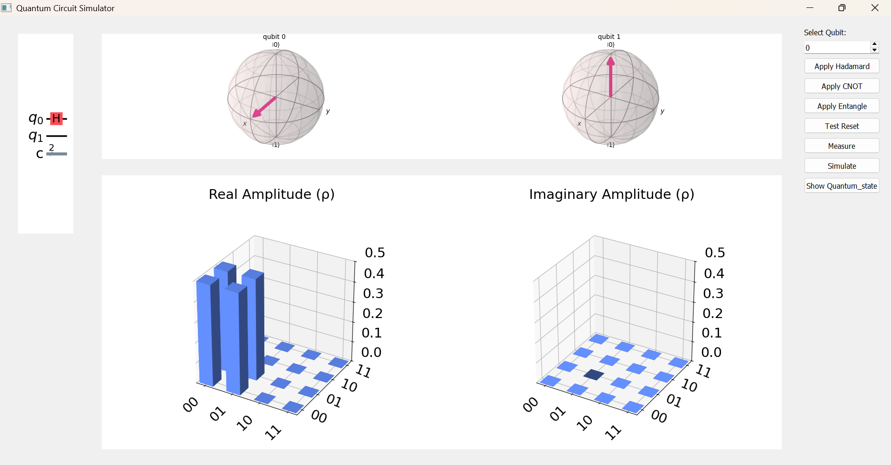

# Quantum GUI



This project provides a graphical user interface (GUI) for simulating quantum circuits using Qiskit.

---


## **Setting Up the Environment**

### 1. **Create and Activate a Virtual Environment**
Follow the instructions in the previous sections to create and activate a virtual environment using Conda or Python's `venv`.

See the link to the file about Virtual environment installation file.
[Virtual Env](https://github.com/owaisishtiaqsiddiqui/quantum-gui/blob/main/Create%20Virtual_env.md)

### 2. **Install Dependencies**
After activating the environment, install the required dependencies:
```bash
pip install -r requirements.txt

### **Running the Application**

To run the main application, use the following command:
python src/main.py

## **Running the Test Files**
1. Navigate to the tests Directory
Change your working directory to the tests folder:
cd tests

2. Run the Tests
Use the unittest module to discover and run the test files:

python -m unittest discover
or
python -m unittest discover -s <path_to_tests> -p "test_*.py"

This will automatically discover and run all test files (e.g., test_quantum.py, test_gui.py) in the tests directory.

3. Run a Specific Test File
To run a specific test file, use:

python -m unittest [test_quantum.py] (Remove the brackets "[]" when executing the command)

4. Run Tests from Anywhere:

If you want to run the tests without navigating to the tests directory, provide the full path to the test file:
python -m unittest [provide file path of test.py]

## Additional Info:
1. Make sure that the virtual environment is activated before running the tests.
2. The test files are located in the tests directory and use Python's built-in unittest framework.
3. If you encounter any issues, verify that all dependencies are installed and the src module is correctly configured in the Python path.
